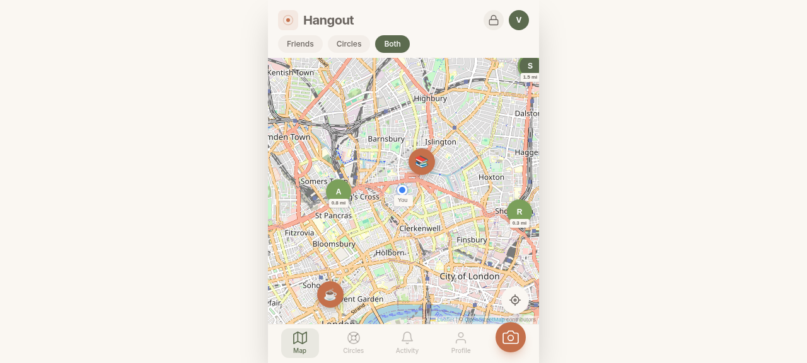
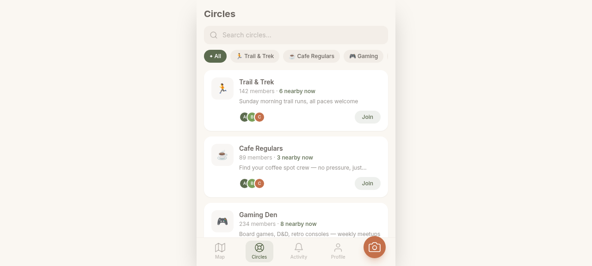
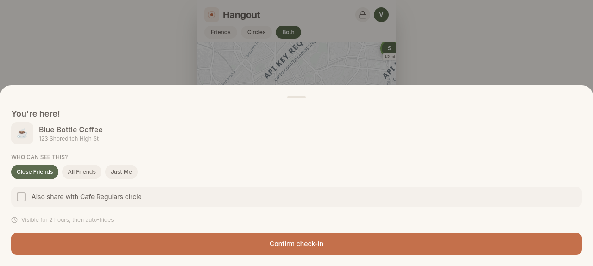
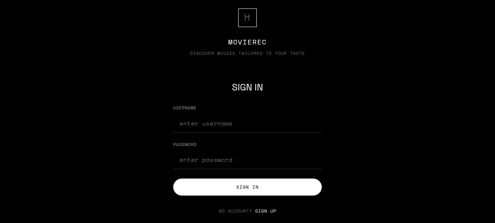
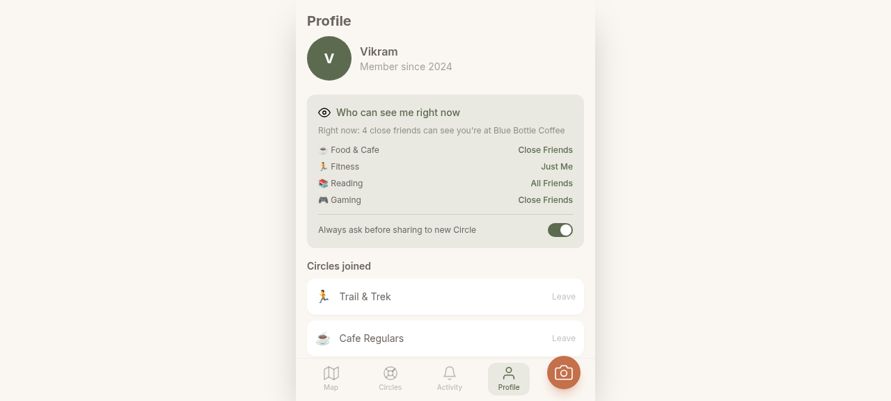

# Hangout — Real-Life Social Map

> Do things together in real life. A location-based social app that helps people meet up spontaneously — no infinite feeds, no like counts, no vanity metrics.



## 🎯 Vision

Hangout is a mobile-first social app designed around one principle: **get people offline doing things together**. It's boring to stare at, useful to open, and satisfying to close.

### Core Philosophy
- **No algorithmic feed** — chronological, sparse activity list
- **No vanity metrics** — no follower counts, no likes, no streaks
- **Privacy by design** — explicit check-in only, never background location
- **Action-oriented** — every screen nudges toward an offline meetup

### Who It's For
- **Priya, 27** — Wants to know which friends are free for spontaneous coffee without texting the whole group
- **Dev, 24** — New to the city, wants to find trail running buddies
- **Amara, 34** — Runs a book club, wants to find new members nearby
- **Sam, 30** — Uses sober meetup circles without it feeling clinical
- **Ravi, 29** — Checks in at his cafe so close friends can drop by

## ✨ Features

### Friends Map
- Real-time map showing checked-in friends (explicit QR/NFC check-in only)
- Color-coded pins: green (<30min), amber (30min–2hr), auto-expire after 2 hours
- Distance badges on each pin (e.g., "0.3 mi")
- Tap a pin for details: venue, time, "I'm heading over" action
- Filter by Friends, Circles, or Both

### Interest Circles
- Discover nearby people who share your interests
- Categories: Trail & Trek, Cafe Regulars, Gaming, Book Club, Support Groups, Dating
- Circle detail with Upcoming Meetups, Members Nearby, About tabs
- Sensitive circles default to anonymous presence

### Check-in Flow
- Mock QR scanner with animated scan line
- Visibility selector: Close Friends / All Friends / Just Me
- Optional circle sharing toggle
- Auto-expiry countdown with toast confirmation

### Privacy Center
- "Who can see me right now" — always one tap away from any screen
- Per-category visibility defaults
- Check-in history (private, deletable)

## 🛠 Tech Stack

- **React 18** — component-based UI
- **Vite** — fast dev server and build
- **Tailwind CSS** — utility-first styling
- **Leaflet** — interactive maps with free OpenStreetMap tiles

## 🚀 Getting Started

```bash
# Clone the repo
git clone https://github.com/vikramrajj/Hangout.git
cd hangout

# Install dependencies
npm install --include=dev

# Start dev server
npm run dev
```

Open http://127.0.0.1:5173 in your browser. For the best experience, use a mobile viewport (390×844).

### Build for Production
```bash
npm run build
npm run preview
```

## 📱 Screenshots

| Map View | Circles | Check-in | Activity | Profile |
|----------|---------|----------|----------|---------|
|  |  |  |  |  |

## 🔒 Privacy Principles

1. **Explicit check-in only** — nothing shown without QR/NFC scan
2. **Visibility scope** — chosen at every check-in moment
3. **Auto-expiry** — check-ins disappear after 2 hours
4. **Circle ≠ location sharing** — joining a circle never exposes your location
5. **Sensitive circles** — anonymous by default, opt-in for visibility
6. **One-tap privacy check** — "Who can see me right now" always accessible

## 🗺 Roadmap

- [ ] Real QR/NFC check-in integration
- [ ] Push notifications for friend check-ins
- [ ] End-to-end encrypted messaging
- [ ] Venue database with auto-populated check-in details
- [ ] Anti-spoofing: GPS proximity verification
- [ ] Accessibility audit (WCAG 2.1 AA)
- [ ] PWA support for home screen installation
- [ ] Real-time WebSocket connections for live check-ins

## 📄 License

MIT License — see [LICENSE](LICENSE) for details.

---

Built with ❤️ for spontaneous real-life connections.
